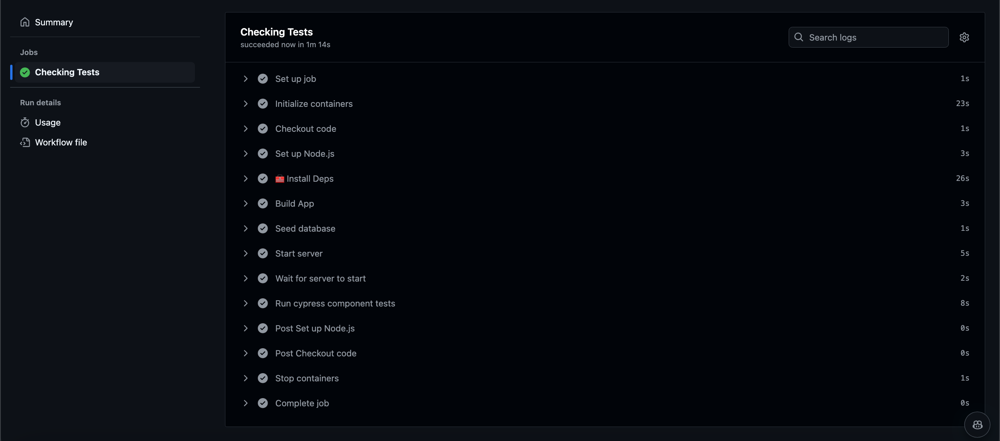

# GitHub-Actions-CI-CD-Setup


## Table of Contents

- [Description](#description)
- [Installation](#installation)
- [Usage](#usage)
- [Screenshots](#screenshots)
- [License](#license)
- [Questions](#questions)

## Description

In this project, a comprehensive CI/CD pipeline is established to streamline the testing and deployment processes essential for scalable applications. Utilizing GitHub Actions for workflow automation, the pipeline enforces quality control through Cypress component testing on each Pull Request made to the develop branch, verifying that code meets defined standards before integration. Upon merging code from develop into main, the pipeline initiates an automated deployment to Render, keeping the live application up-to-date with minimal manual oversight.

The pipeline setup includes carefully configured YAML workflows, environment-specific variables, and webhooks for efficient deployment through Render. This approach enhances team collaboration by allowing for feature-based branching, ensuring consistent test execution, and providing a controlled deployment process that improves reliability and reduces errors. This CI/CD configuration promotes best practices for modern development, supporting code quality, continuous integration, and smooth, predictable deployment cycles in a professional development environment.

## Installation

1. Clone the repository:
   ```
   git clone https://github.com/yourusername/github-actions-ci-cd.git
   cd github-actions-ci-cd
   ```

2. Install dependencies for both client and server:
    ```
    npm install
    ```

3. Set up environment variables:

    -   In the server directory, create a .env file and add the following variables:
    ```
    MONGODB_URI='your_mongodb_connection_string'
    ```

## Usage

### 1. Configure Render for Deployment

Follow these steps to set up automatic deployment to Render for your project:

- Create a Web Service on Render:

    - Connect the site to your GitHub repository.
    - In Build Command, enter the command required to build the application (e.g., npm run build).
    - Set Publish Directory to your build output directory, such as dist or build.
    - Add MongoDB and other necessary environment variables.
    - Disable Auto-Deploy to control deployments through GitHub Actions only.

- Configure Deploy Hook:

    - Retrieve the deploy hook URL from Render (found in your Render site's settings).
    - In your GitHub repository settings, go to Settings > Secrets and Variables > Actions and add the deploy hook URL as a new secret with the key name RENDER_DEPLOY_HOOK_URL.

### 2. Configure and Protect Branches

Set up branch rules and triggers for your CI/CD pipeline:

- Set Up Branches:

    - From the main branch, create a new branch called develop and push it to GitHub.
    - For any new feature or testing work, create a branch off develop (e.g., feature/testing), make a minor code change, and push it to GitHub.

- Create a Pull Request and Test Workflow:

    - Open a pull request comparing the feature branch (feature/testing) to develop to initiate the GitHub Actions Cypress test workflow.
    - Check the GitHub Actions tab to verify the Testing workflow has triggered and completed successfully.

- Protect Branches:

    - In your GitHub repository, go to Settings > Branches > Branch protection rules.
    - Add a new rule for the main and develop branches:
    - Enable branch protections and select relevant checks (e.g., require status checks to pass before merging).
    - Specify the GitHub Action names (from YAML) to enforce successful test results before allowing merges.

### 3. Push to GitHub

After making code changes, push your work to the appropriate branch to trigger the relevant workflows:

```
git add .
git commit -m "Commit message describing changes"
git push origin <branch-name>

```

### 4. Create Pull Requests and Monitor Tests

- For new features, create a pull request comparing your feature branch with develop. This will trigger the Cypress test action.

- Once code in develop is ready to release, open a pull request to merge develop into main. If all checks pass, merging to main will automatically deploy the latest code to Render.

## Screenshots



Link to the deployed site:

https://github-actions-ci-cd-setup.onrender.com

## License

Copyright (c) 2024 ASgithub11

Permission is hereby granted, free of charge, to any person obtaining a copy of this software and associated documentation files (the “Software”), to deal in the Software without restriction, including without limitation the rights to use, copy, modify, merge, publish, distribute, sublicense, and/or sell copies of the Software, and to permit persons to whom the Software is furnished to do so, subject to the following conditions:

The above copyright notice and this permission notice shall be included in all copies or substantial portions of the Software.

THE SOFTWARE IS PROVIDED “AS IS”, WITHOUT WARRANTY OF ANY KIND, EXPRESS OR IMPLIED, INCLUDING BUT NOT LIMITED TO THE WARRANTIES OF MERCHANTABILITY, FITNESS FOR A PARTICULAR PURPOSE AND NONINFRINGEMENT. IN NO EVENT SHALL THE AUTHORS OR COPYRIGHT HOLDERS BE LIABLE FOR ANY CLAIM, DAMAGES OR OTHER LIABILITY, WHETHER IN AN ACTION OF CONTRACT, TORT OR OTHERWISE, ARISING FROM, OUT OF OR IN CONNECTION WITH THE SOFTWARE OR THE USE OR OTHER DEALINGS IN THE SOFTWARE.

## Questions

If you have any questions, reach me on Github: https://github.com/ASgithub11

or email me here at aishasiddiqa151@gmail.com
